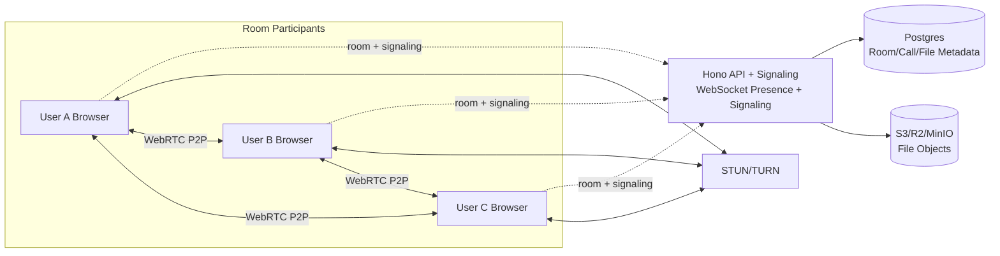
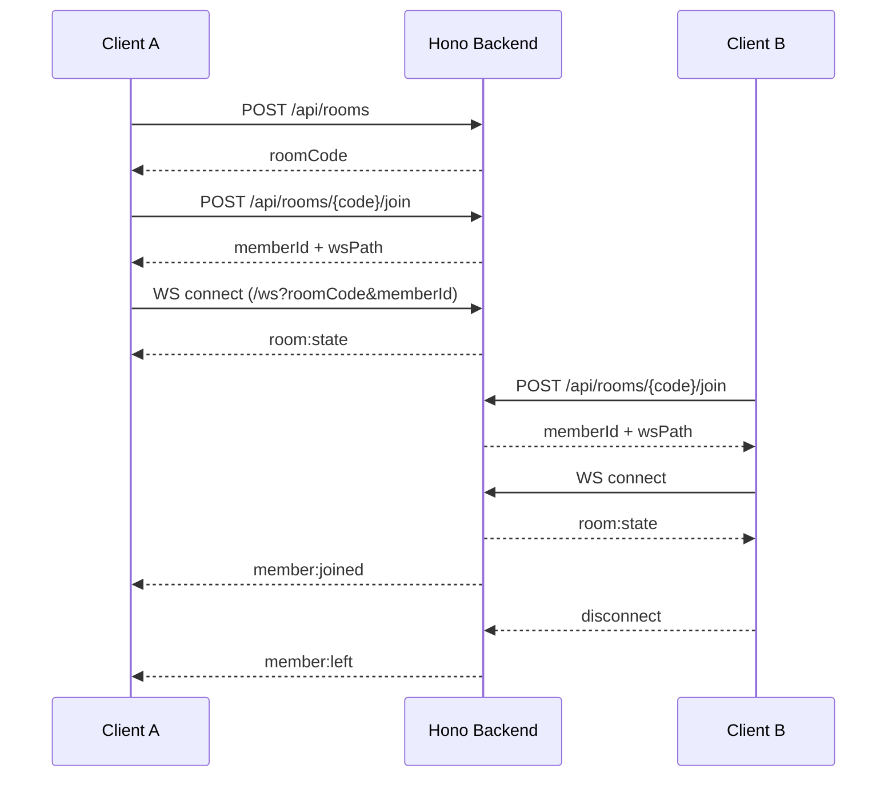
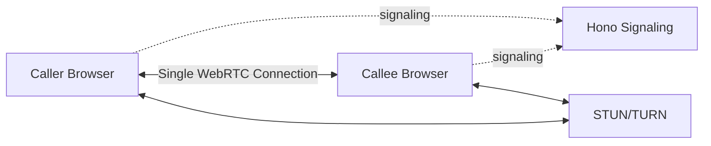
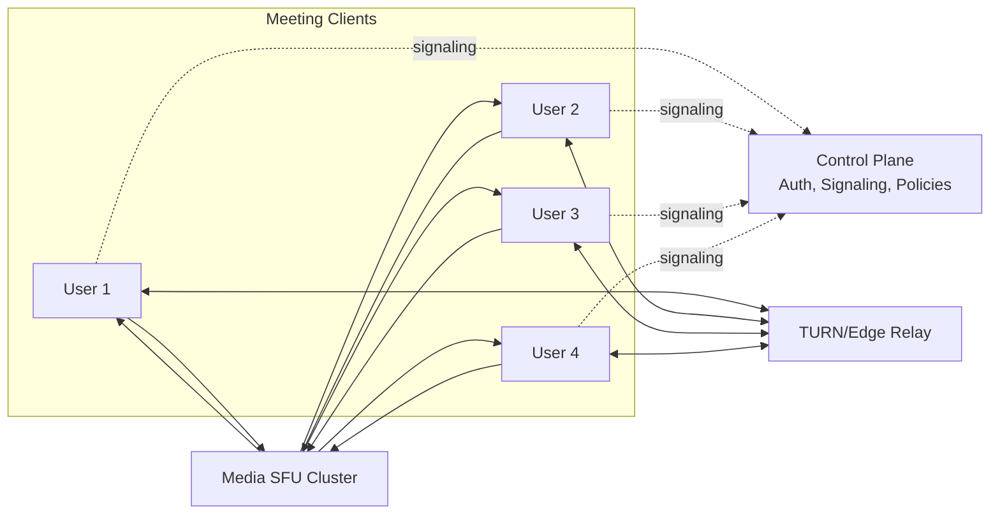

# Mesh-First WebRTC Room App (Planning Notes)

> This is not the final blog post. These are structured notes for a later writing prompt.

## Decision Snapshot

- Chosen approach: mesh-first WebRTC for calls (fast MVP for small groups)
- Room model: create/join room, optional call participation, shared file history
- Backend role: Hono signaling + room state + durable file metadata
- Scale expectation: best for 2-4 active video callers, acceptable up to ~6 in ideal conditions

## Product Requirements to Cover

- Create room and join room by code/link
- In-room file sharing where all members can see and download
- In-room call controls: start call, join call, leave call, end call
- Call is optional per member (room member != call participant)

## Why P2P Still Needs a Backend

- WebRTC peers must exchange signaling data (offer/answer/ICE) before connecting
- Room membership and presence need a source of truth
- File history visibility for late joiners requires persistence
- TURN credentials and connection troubleshooting rely on backend support
- Auth and abuse protection cannot be done safely in pure client-only mode

## High-Level Architecture (MVP)

### 1) Client App (React + TypeScript)

- UI for room lifecycle, member list, call controls, file timeline
- WebSocket client for room/presence/signaling events
- WebRTC peer connection manager for mesh call sessions
- Upload/download flow for files via presigned URLs

### 2) Hono Backend (Control Plane)

- REST endpoints for room and file actions
- WebSocket hub for realtime events and signaling relay
- Room state management: members, active call, call participants
- Validation, auth, and rate limiting

### 3) Persistence Layer

- PostgreSQL for durable room/call/file metadata
- Object storage (S3/R2/MinIO) for file binaries
- Optional Redis for pub/sub and presence if scaling to multiple backend instances

### 4) Connectivity Infra

- STUN server for NAT traversal
- TURN (coturn) for relay fallback when direct P2P fails

## Mesh Call Topology Notes

- In mesh, each call participant creates a connection to every other participant
- Per user connections: N - 1
- Total room call connections: N * (N - 1) / 2
- Bandwidth/CPU costs grow quickly with N

Implication:
- Mesh is great for fast MVP and small groups
- For regular larger calls, migrate media layer to SFU later

## Data Model (Initial)

### rooms

- id (uuid)
- room_code (short unique string)
- created_by
- created_at

### room_members

- room_id
- user_id
- display_name
- joined_at
- left_at (nullable)
- last_seen_at

### calls

- id
- room_id
- status (active | ended)
- started_by
- started_at
- ended_at

### call_participants

- call_id
- user_id
- joined_at
- left_at

### files

- id
- room_id
- uploader_id
- filename
- mime_type
- size_bytes
- storage_key
- checksum
- created_at

## Realtime Event Contract (Draft)

Client -> Server:
- room:create
- room:join
- room:leave
- call:start
- call:join
- call:leave
- call:end
- signal:offer
- signal:answer
- signal:ice
- file:prepare-upload
- file:upload-complete

Server -> Client:
- room:state
- member:joined
- member:left
- call:started
- call:participant-joined
- call:participant-left
- call:ended
- signal:offer
- signal:answer
- signal:ice
- file:added
- error

## Suggested API Surface (REST)

- POST /api/rooms -> create room
- POST /api/rooms/:roomCode/join -> join room
- GET /api/rooms/:roomCode/state -> room snapshot
- POST /api/rooms/:roomCode/files/prepare -> presigned upload metadata
- POST /api/rooms/:roomCode/files/complete -> finalize + broadcast
- GET /api/rooms/:roomCode/files -> list files
- GET /api/files/:fileId/download -> signed download URL
- GET /api/health -> service health

## Libraries and Packages

Already in project:
- hono
- react
- vite
- typescript

Recommended to add:

Backend:
- ws (or socket.io if you prefer built-in room helpers)
- zod (request/event validation)
- drizzle-orm + postgres driver
- @aws-sdk/client-s3
- @aws-sdk/s3-request-presigner
- jose (JWT)
- pino (logging)
- ioredis (optional scaling)

Frontend:
- zustand (local app/session state)
- @tanstack/react-query (optional server-state sync)
- simple-peer (optional wrapper over RTCPeerConnection)

Infra:
- coturn (TURN relay)

## Security and Reliability Checklist

- Auth or scoped guest tokens for room join
- Authorization checks for every room and file operation
- File size/type limits and upload content checks
- Signed URLs with short TTL
- Signaling rate limits and room creation throttles
- Heartbeats and stale socket cleanup
- Reconnect and state resync flow
- ICE restart support on network changes

## MVP Milestones

1) Room lifecycle
- Create/join room, presence list, reconnect-safe room state sync

2) Signaling pipeline
- WebSocket events for offer/answer/ICE routing and peer targeting

3) Call controls
- Start call, join/leave call, end call, mesh peer manager

4) File sharing
- Presigned upload flow, metadata persistence, room file timeline, download links

5) Hardening
- Auth, rate limits, retry logic, telemetry, error boundaries

## Observability and Success Metrics

- Room create and join success rate
- Time to first media connection
- ICE failure rate by reason
- TURN usage ratio
- Call join success and average call duration
- File upload success/failure and average size

## Blog Angles for Final Writing

- Why WebRTC apps still need a backend
- How mesh topology affects practical group size
- Modeling room state where calls are optional
- Reliable file sharing in a P2P-first product
- Designing MVP now while keeping SFU migration path later

## Future Migration Path (When Mesh Limits Hit)

- Keep room/file/control-plane design unchanged
- Swap only media transport from mesh to SFU (LiveKit/mediasoup/Janus)
- Retain same user-facing room and call semantics

## Current Build Status (Slice 1)

- Implemented: `POST /api/rooms` create room
- Implemented: `POST /api/rooms/:roomCode/join` join room with display name
- Implemented: `GET /api/rooms/:roomCode/state` room snapshot
- Implemented: `/ws` realtime presence channel with `room:state`, `member:joined`, `member:left`
- Implemented: frontend room UI for create/join and live member online status

## Architecture Diagram (Current Mesh-First Room Plan)

## Sequence Diagram (Create, Join, Presence)

## If This Were 1:1 Only (No Room Concept)

What changes:
- Replace room code + member list with direct session/call link
- Exactly two participants, one peer connection
- Presence is simpler: online/offline for the other person only
- No need for room-wide broadcast events

What stays the same:
- Signaling backend still required (offer/answer/ICE)
- STUN/TURN still required for NAT traversal reliability
- Auth and abuse checks still required

## Why We Did Not Use SFU First

- MVP speed: mesh lets us ship working calls quickly with fewer moving parts
- Product uncertainty: early stage needs user flow validation more than infra scale
- Cost and complexity: SFU adds media server ops, tuning, and observability burden
- Scope fit: initial target is small active call groups (about 2-4)

When we should switch:
- Regular calls above 4-6 active video users
- Need stronger quality consistency on weak networks/devices
- Need advanced media controls (recording, layout policies, bandwidth adaptation)

## How Teams / Google Meet Usually Do It (High Level)

- They generally use SFU-based architectures, not full mesh for group calls
- Each client sends one uplink to media infrastructure; SFU forwards selected streams
- Heavy use of adaptive bitrate, simulcast/SVC, congestion control, and region routing
- Large control plane handles auth, meeting policy, telemetry, and failure recovery
- TURN and edge POP coverage are used aggressively for connectivity reliability

## Advantages and Disadvantages of Our Mesh-First Method

Advantages:
- Fast to build and reason about
- No media server needed on day one
- Good for small groups and low initial infra cost
- Clear migration path to SFU later if room/control design is clean

Disadvantages:
- Scales poorly as participants increase (CPU + upload cost per user)
- Quality becomes inconsistent faster on mobile/weak networks
- Harder to support larger meetings and advanced media features
- Troubleshooting becomes harder as peer count and network variance grow
